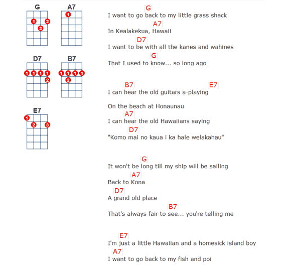
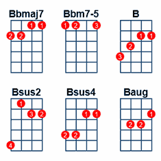
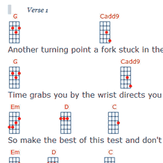
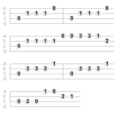
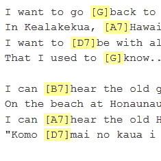
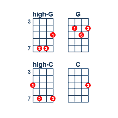
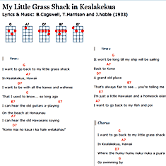
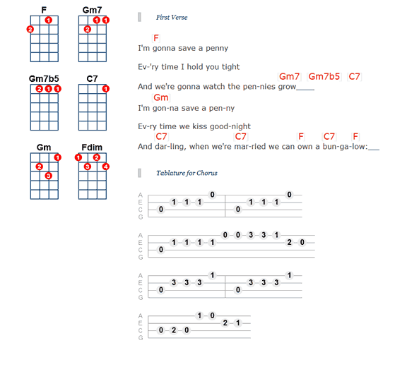

# UkeGeeks Song Formatter

[](https://github.com/buzcarter/song-formatter/actions/workflows/publishDemo.yml)

Convert ChordPro marked-up text to HTML, complete with chord fingering diagrams.

**Important:** *This is early stages of updating the UkeGeek's Scriptasaurus Song Editor, as such,
this is an alpha test release: the final API is likely to change greatly.*

##### Status Update

> *Currently converting dozens of manual tests to automated tests and adding support for other stringed instrument support (yup, finally guitars, not just ukuleles). On track to have full 1.0 release October 2023.*

##### Songsheets Perfect For Clubs 



## Installation

With Node Package Manager (npm)

```
npm install @ukegeeks/song-formatter
```

## Features

| **Fingering Diagrams**                                                      | **Mini-Diagrams**                                                          |
|-----------------------------------------------------------------------------|----------------------------------------------------------------------------|
|                  |          |
| Easy to read chord diagrams with over 180 optimized fingerings pre-defined. | Mix mini-chord fingering diagrams above lyrics for quick reading.          |

| **Tablature**                                                               | **Easy Markup**                                                            |
|-----------------------------------------------------------------------------|----------------------------------------------------------------------------|
|                                      |         |
| Easy on the eyes tabs for solo uke.                                         | Leverages intuitive ChordPro Markup, converts plain text on-the-fly.       |

| **Define Your Own Chords**                                                  | **Print Power**                                                            |
|-----------------------------------------------------------------------------|----------------------------------------------------------------------------|
|              |  |
| Include alternative voicings, power-chords, or any chord shape you like.    | Control how your songs print with multiple columns.                        |

* Add your own custom chords and fingerings
* Specify diagram colors & sizes
* Choose whether to include diagrams to the side or above the lyrics
* Multiple songs per page
* Transposing

### Mix Tablature, Lyrics, & Fingering Diagrams




## Usage

...

## Demo/Test

##### Coming Soon
